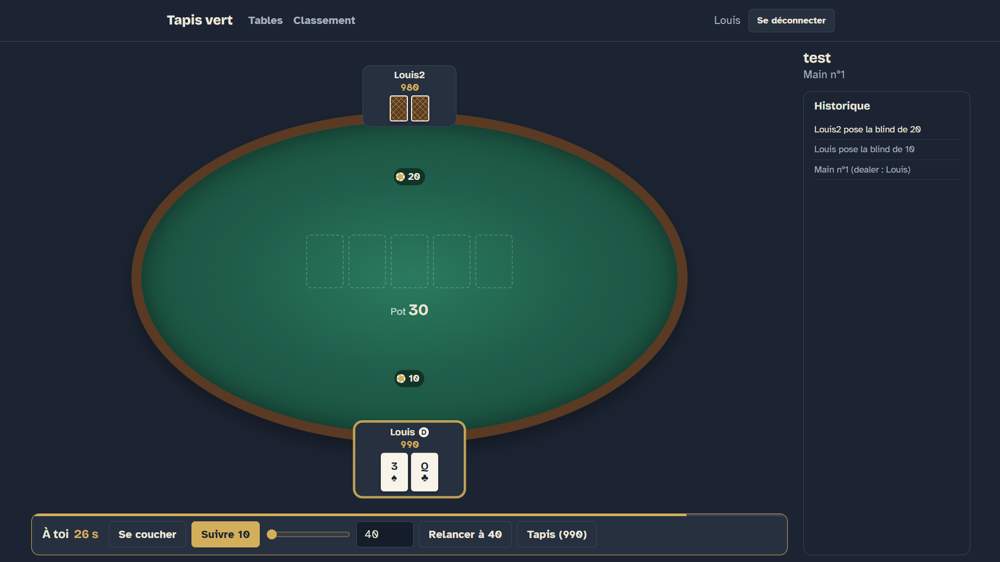
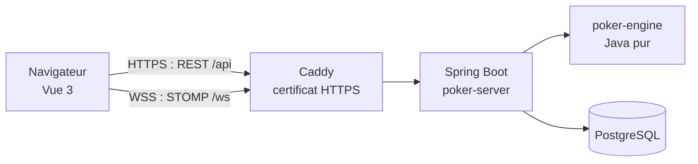

# Tapis vert — Poker Texas Hold'em multijoueur

[](https://github.com/LouisADHN/poker_game/actions/workflows/ci.yml)

Application web pour jouer au **Texas Hold'em No Limit entre amis, en temps réel**.
Création de tables, parties multijoueurs synchronisées par WebSocket, statistiques et classement des joueurs.

**Jouer en ligne : [poker.louisadhn.fr](https://poker.louisadhn.fr)**



---

## Sommaire

- [Fonctionnalités](#fonctionnalités)
- [Architecture](#architecture)
- [Stack technique](#stack-technique)
- [Points techniques notables](#points-techniques-notables)
- [Structure du dépôt](#structure-du-dépôt)
- [Lancer le projet en local](#lancer-le-projet-en-local)
- [Tests et qualité](#tests-et-qualité)
- [Configuration](#configuration)
- [Déploiement](#déploiement)
- [API](#api)
- [Limites connues et pistes d'évolution](#limites-connues-et-pistes-dévolution)
- [Auteur](#auteur)

---

## Fonctionnalités

**Comptes**
- Inscription et connexion, avec mots de passe hachés (BCrypt) et authentification par jeton JWT
- Session conservée entre deux visites, déconnexion automatique à l'expiration du jeton

**Lobby**
- Liste des tables mise à jour **en direct** pour tous les joueurs connectés
- Création d'une table : nom, blinds, tapis de départ, nombre de joueurs (2 à 10)
- Rejoindre ou quitter une table, transfert automatique au joueur suivant si le créateur part

**Partie**
- Règles complètes du Texas Hold'em No Limit : blinds, preflop, flop, turn, river, showdown
- Relances minimales, all-in incomplets, **pots secondaires (side pots)** et partage du pot
- Règles spécifiques au tête-à-tête (le dealer est small blind et parle en premier preflop)
- Temps de réflexion limité (30 s par défaut), avec action automatique (check ou fold) à l'expiration
- Cartes privées envoyées **uniquement** à leur propriétaire
- Table de jeu adaptative : les joueurs sont placés sur une ellipse, toujours vus depuis sa propre place

**Statistiques**
- Classement général : victoires, taux de victoire, mains jouées et gagnées
- Statistiques personnelles

**Accessibilité**
- Navigation complète au clavier, contours de focus visibles
- Cartes, tables et actions décrites pour les lecteurs d'écran
- Contrastes soignés, respect du réglage « réduire les animations »
- Interface utilisable sur ordinateur comme sur téléphone

---

## Architecture

Le projet est un **monorepo Maven multi-modules**, avec un front Vue séparé :

| Module | Rôle | Dépendances |
|---|---|---|
| [`poker-engine`](poker-engine) | Moteur de jeu : règles, évaluation des mains, pots, tours d'enchères | **Aucune** (Java pur) |
| [`poker-server`](poker-server) | API REST, WebSocket, sécurité, persistance, orchestration des parties | `poker-engine`, Spring Boot |
| [`poker-web`](poker-web) | Interface utilisateur | Vue 3, TypeScript |



**Le moteur de jeu ne connaît ni Spring, ni le réseau, ni la base de données.** Il communique uniquement par deux interfaces :

- `PlayerController` : le moteur demande une décision à un joueur (`Action decide(GameView view)`) ;
- `GameListener` : le moteur publie ses événements (blinds, actions, cartes, gains…).

Le même moteur a ainsi pu être utilisé d'abord en console, avec des bots, puis branché au WebSocket sans aucune modification.

**Le flux d'une partie :**

1. Le créateur lance la partie (`POST /api/tables/{id}/start`).
2. Le serveur crée une `GameSession` : un moteur, un `RemotePlayerController` par joueur, et un **thread virtuel** dédié à la table.
3. Quand c'est à un joueur de parler, son contrôleur lui envoie un message privé `YOUR_TURN`, puis attend sa réponse.
4. Le navigateur envoie l'action par WebSocket, qui est transmise au contrôleur du joueur.
5. Les événements du moteur sont diffusés à toute la table, sauf les cartes privées, envoyées à leur seul propriétaire.
6. En fin de partie, le résultat est enregistré pour les statistiques.

---

## Stack technique

| Domaine | Technologies |
|---|---|
| Moteur de jeu | Java 21 (records, sealed interfaces, pattern matching) |
| Serveur | Spring Boot 4, Spring Web MVC, Spring WebSocket (STOMP) |
| Sécurité | Spring Security, OAuth2 Resource Server (JWT HS256), BCrypt |
| Persistance | PostgreSQL 18, Spring Data JPA, Hibernate, Flyway |
| Front | Vue 3, TypeScript, Vite, Pinia, Vue Router, `@stomp/stompjs` |
| Tests | JUnit 5, MockMvc, Testcontainers, Vitest, Vue Test Utils |
| Qualité | ESLint, Prettier, vérification TypeScript (`vue-tsc`) |
| Livraison | Docker (build multi-étapes), GitHub Actions, GitHub Container Registry |
| Hébergement | VPS Ubuntu (OVH), Docker Compose, Caddy (HTTPS automatique Let's Encrypt) |

---

## Points techniques notables

### Un moteur de jeu testé indépendamment

- **Évaluation des mains** : regroupement des cartes par rang, puis tri par taille de groupe, ce qui donne directement la catégorie et les départages. Gestion de la quinte « roue » (A-2-3-4-5), et sélection de la meilleure combinaison de 5 cartes parmi 7 par backtracking.
- **Pots secondaires** : découpage du pot en tranches selon les contributions des joueurs all-in, avec conservation des jetons vérifiée à chaque main.
- **Tours d'enchères** : relance minimale, option de la big blind, all-in incomplet qui ne rouvre pas les enchères.

### Le pont entre un moteur bloquant et un réseau asynchrone

Le moteur attend la décision de chaque joueur de manière **bloquante**, alors que les actions arrivent de manière **asynchrone** par WebSocket. Chaque table possède son propre **thread virtuel** (Java 21), et chaque joueur un `RemotePlayerController` fondé sur une `BlockingQueue` :

- le thread de la table attend l'action dans la file, avec un délai maximum ;
- le thread WebSocket y dépose l'action reçue ;
- une action envoyée hors de son tour est refusée, et ne peut jamais être consommée au tour suivant.

### Concurrence

- Le lobby est protégé par un verrou unique : deux joueurs ne peuvent pas prendre la même dernière place, ni un joueur s'asseoir à deux tables. Ces garanties sont vérifiées par des tests lançant **20 threads simultanés**, répétés plusieurs fois.
- Les tests d'intégration font jouer de vrais clients WebSocket, sur un vrai serveur.

### Sécurité

- **Jetons JWT signés** (HMAC-SHA256), vérifiés à chaque requête HTTP et à l'ouverture de chaque session WebSocket (trame STOMP `CONNECT`).
- **Pas d'énumération de comptes** : même message et même temps de réponse que le pseudo existe ou non (calcul BCrypt factice).
- **Cartes privées filtrées côté serveur** : le navigateur d'un joueur ne reçoit jamais les cartes des autres avant le showdown.
- **Secrets hors du code** : clé JWT et mot de passe de la base fournis par variables d'environnement. En production, l'application refuse de démarrer si la clé est absente.
- Conteneur exécuté **sans privilèges administrateur**, base de données jamais exposée sur Internet.

### Statistiques calculées, pas stockées

Le serveur enregistre des **faits** (une ligne par partie et par participant, avec sa place finale), et les statistiques sont **calculées** par des requêtes SQL d'agrégation (`COUNT … FILTER`, `GROUP BY`). Il n'existe qu'une source de vérité, et une nouvelle statistique se résume à une nouvelle requête.

### Interface

- Table de jeu dimensionnée avec les **container queries** (`cqw`, `cqh`) : les places, les cartes et les textes s'adaptent à la taille de la table, sur tous les écrans.
- Positionnement des joueurs par trigonométrie sur une ellipse, transmis au CSS par des variables personnalisées.
- Polices auto-hébergées (pas d'appel à des serveurs tiers).

---

## Structure du dépôt

```
poker/
├── poker-engine/                 Moteur de jeu (Java pur)
│   └── src/main/java/fr/louis/poker/
│       ├── model/                Cartes, paquet, joueurs, table
│       ├── evaluation/           Évaluation des mains
│       ├── engine/               Moteur, tours d'enchères, pots
│       ├── action/               Actions des joueurs
│       ├── controller/           Interface PlayerController et vues
│       └── event/                Événements et listeners
├── poker-server/                 Serveur Spring Boot
│   └── src/main/
│       ├── java/fr/louis/poker/server/
│       │   ├── auth/             Inscription et connexion
│       │   ├── user/             Comptes utilisateurs
│       │   ├── security/         Jetons JWT
│       │   ├── lobby/            Tables et lobby
│       │   ├── game/             Sessions de jeu en temps réel
│       │   ├── stats/            Résultats, statistiques, classement
│       │   ├── ws/               Configuration WebSocket
│       │   └── config/           Sécurité, service de l'application Vue
│       └── resources/db/migration/   Migrations Flyway
├── poker-web/                    Interface Vue 3
│   └── src/
│       ├── api/                  Appels HTTP, client STOMP, types
│       ├── stores/               État partagé (Pinia)
│       ├── views/                Pages
│       └── components/           Composants réutilisables
├── deploy/                       Fichiers de déploiement (Compose, Caddy)
├── .github/workflows/ci.yml      Intégration continue
├── Dockerfile                    Image de production
└── compose.prod.yaml             Lancement local en configuration de production
```

---

## Lancer le projet en local

### Prérequis

- **JDK 21** ou plus récent
- **Node.js 22** ou plus récent
- **Docker Desktop**, démarré (pour PostgreSQL et les tests)

### 1. Le serveur

```bash
./mvnw -pl poker-server -am spring-boot:run
```

Spring Boot démarre automatiquement un conteneur PostgreSQL (fichier `poker-server/compose.yaml`), applique les migrations Flyway, puis écoute sur le port **8080**.

> Depuis IntelliJ IDEA, lancez `PokerServerApplication` en réglant le *Working directory* de la configuration sur le dossier `poker-server`.

### 2. Le front

```bash
cd poker-web
npm install
npm run dev
```

Ouvrez **http://localhost:5173**. Vite relaie automatiquement les requêtes `/api` et `/ws` vers le serveur.

### Variante : tout en conteneurs, comme en production

```bash
cp .env.example .env    # puis renseignez les secrets
docker compose -f compose.prod.yaml up -d --build
```

L'application est alors servie par Spring Boot sur **http://localhost:8080**.

---

## Tests et qualité

```bash
# Moteur et serveur : tests unitaires et d'intégration (Docker requis pour Testcontainers)
./mvnw verify

# Front
cd poker-web
npm run type-check     # vérification TypeScript
npx eslint .           # analyse du code
npx vitest run         # tests unitaires
```

Les tests couvrent notamment :

- les **règles du jeu** : évaluation des mains, pots secondaires, tours d'enchères, déroulement complet d'une main ;
- la **sécurité** : jetons expirés ou falsifiés, routes protégées, réponses identiques pour un pseudo inconnu ou un mauvais mot de passe ;
- la **concurrence** du lobby, avec accès simultanés ;
- des **parties de bout en bout**, jouées par de vrais clients WebSocket, avec vérification que les cartes privées ne fuient pas ;
- les **statistiques**, calculées sur un jeu de parties construit à la main.

---

## Configuration

| Variable | Rôle | Défaut |
|---|---|---|
| `POKER_JWT_SECRET` | Clé de signature des jetons (Base64, au moins 32 octets) | Clé de développement ; **obligatoire** avec le profil `prod` |
| `POKER_ALLOWED_ORIGINS` | Origines autorisées pour le WebSocket | `http://localhost:*` |
| `SPRING_PROFILES_ACTIVE` | `prod` en production | — |
| `SPRING_DATASOURCE_URL` | Adresse de la base | Fournie par Docker Compose en développement |
| `SPRING_DATASOURCE_USERNAME` / `PASSWORD` | Identifiants de la base | — |
| `POKER_GAME_TURN_TIMEOUT` | Temps de réflexion par action | `30s` |
| `POKER_GAME_PAUSE_BETWEEN_HANDS` | Pause entre deux mains | `3s` |

Pour générer une clé :

```bash
openssl rand -base64 32
```

---

## Déploiement

### Intégration continue

À chaque push, [GitHub Actions](.github/workflows/ci.yml) exécute trois jobs :

1. **Tests Java** : compilation et tous les tests du moteur et du serveur ;
2. **Front** : TypeScript, ESLint, Vitest et compilation ;
3. **Image Docker** : construite et publiée sur le GitHub Container Registry, **uniquement sur `master` et si les deux premiers jobs réussissent**.

### Image Docker

Le [`Dockerfile`](Dockerfile) construit l'application en trois étapes : compilation du front (Node), construction du serveur avec le front intégré (JDK et Maven), puis une image finale légère contenant uniquement Java et l'application, exécutée sans privilèges.

### Production

Le serveur de production n'a besoin que de trois fichiers, dans [`deploy/`](deploy) :

- `compose.deploy.yaml` : Caddy, l'application et PostgreSQL ;
- `Caddyfile` : HTTPS automatique et proxy vers l'application ;
- `.env` : les secrets, créé sur le serveur à partir de `.env.example`, **jamais commité**.

```bash
docker compose -f compose.deploy.yaml up -d
```

Mise à jour vers la dernière image publiée :

```bash
docker compose -f compose.deploy.yaml pull
docker compose -f compose.deploy.yaml up -d
docker image prune -f
```

Sauvegarde de la base :

```bash
docker compose -f compose.deploy.yaml exec db pg_dump -U poker poker > sauvegarde-$(date +%F).sql
```

---

## API

### REST

Toutes les routes sauf l'authentification exigent l'en-tête `Authorization: Bearer <jeton>`.

| Méthode | Route | Rôle |
|---|---|---|
| `POST` | `/api/auth/register` | Inscription |
| `POST` | `/api/auth/login` | Connexion, renvoie un jeton JWT |
| `GET` | `/api/users/me` | Profil de l'utilisateur connecté |
| `GET` | `/api/users/me/stats` | Statistiques personnelles |
| `GET` | `/api/leaderboard?limit=20` | Classement général |
| `GET` | `/api/tables` | Liste des tables |
| `POST` | `/api/tables` | Créer une table |
| `GET` | `/api/tables/{id}` | Détail d'une table |
| `POST` | `/api/tables/{id}/join` | Rejoindre une table |
| `POST` | `/api/tables/{id}/leave` | Quitter une table |
| `POST` | `/api/tables/{id}/start` | Lancer la partie (créateur uniquement) |

Les erreurs suivent le format standard **Problem Details** (RFC 9457).

### WebSocket (STOMP)

Connexion sur `/ws`, avec le jeton dans l'en-tête `Authorization` de la trame `CONNECT`.

| Destination | Sens | Contenu |
|---|---|---|
| `/topic/lobby` | serveur → tous | Liste des tables, à chaque changement |
| `/topic/tables/{id}` | serveur → tous | Détail d'une table, à chaque changement |
| `/topic/tables/{id}/game` | serveur → table | Déroulement public de la partie |
| `/user/queue/game` | serveur → joueur | Cartes privées, tour de jeu, erreurs |
| `/app/tables/{id}/action` | joueur → serveur | Action du joueur |

Messages de partie : `HAND_STARTED`, `BLIND_POSTED`, `HOLE_CARDS`, `BOARD`, `PLAYER_ACTED`, `HAND_REVEALED`, `POT_WON`, `HAND_ENDED`, `YOUR_TURN`, `GAME_OVER`, `ERROR`.

Exemple d'action envoyée par le navigateur :

```json
{ "type": "RAISE", "total": 120 }
```

---

## Limites connues et pistes d'évolution

**Limites actuelles**

- Les tables et les parties en cours vivent en mémoire : un redémarrage du serveur les interrompt.
- Un joueur qui recharge la page en pleine main retrouve l'état complet de la table au tour de jeu suivant.
- Une seule instance du serveur (broker STOMP en mémoire).

**Pistes d'évolution**

- Route renvoyant l'état complet d'une partie, pour une reconnexion instantanée
- Spectateurs, discussion à la table
- Historique détaillé des mains jouées
- Déploiement continu automatique après chaque version validée

---

## Auteur

**Louis** — étudiant en BUT Informatique, parcours Ingénierie Logicielle, IUT Nancy-Charlemagne

[GitHub](https://github.com/LouisADHN)